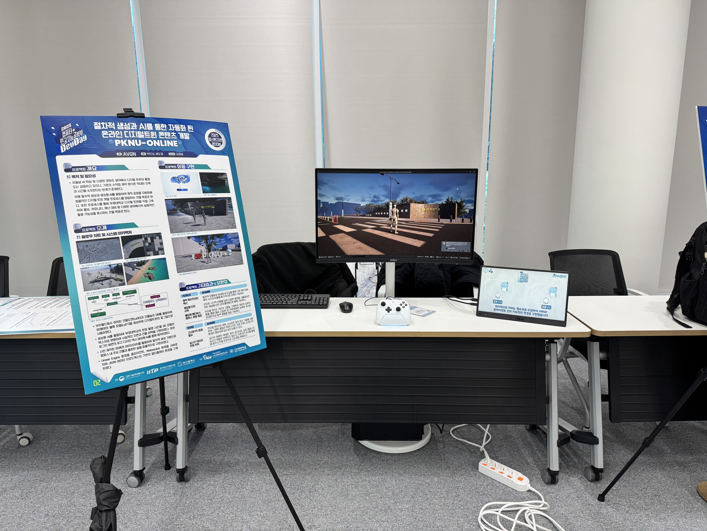
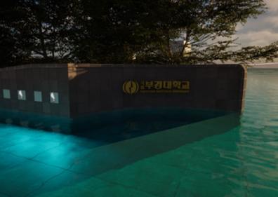
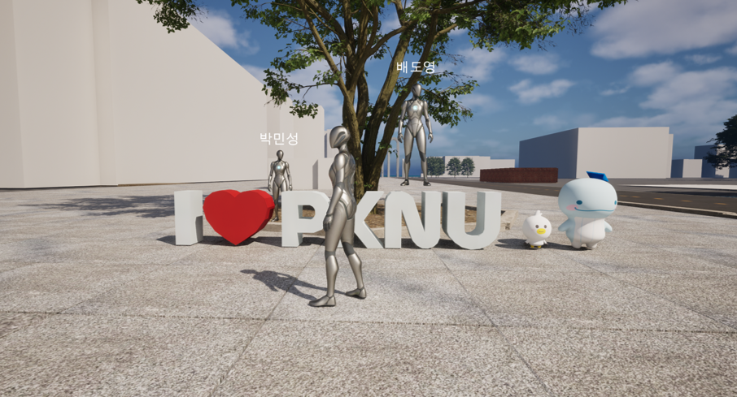

# PKNU-ONLINE

> 생성형 AI와 절차적 생성(PCG)으로 구축한 부경대학교 캠퍼스 디지털 트윈

> 👆 이미지를 클릭하면 유튜브 소개 영상으로 이동합니다.

| 항목 | 내용 |
| :--- | :--- |
| 기간 | 2025 (캡스톤디자인) |
| 팀 | AVGN (2인)
| 엔진 | Unreal Engine 5 (PCG, Nanite, Lumen) |
| 수상 | 2025 컴퓨터인공지능공학부 캡스톤디자인 경진대회 장려상 |
| 담당 | Lead Developer — 에셋 파이프라인 설계 및 도구 개발, UE5 환경 구축 |

 

 

## 🎮 프로젝트 소개

**PKNU-ONLINE**은 부경대학교 캠퍼스를 1:1 스케일의 디지털 트윈으로 제작하여 다양한 사람들과 만나고 소통할 수 있는 공간, 폭우로 인한 침수 등의 재난 시뮬레이션, 자율주행의 학습 등 다양한 곳에 사용할 수 있도록 하는 프로젝트입니다.
저희는 생성형 AI를 활용하여 적은 인원, 부족한 시간에도 퀄리티 높은 부경대학교를 제작하는 것을 목표로 하였습니다.

 

 

## 🏆 수상 실적

- **2025 컴퓨터 인공지능 공학부 캡스톤디자인 경진대회 장려상**

 

## 🙋 담당 범위

2인 팀 프로젝트이며, 각자의 담당은 다음과 같습니다.

| 영역 | 담당 |
| :--- | :--- |
| GIS 기반 화이트박스 모델 구축 | 박민성 |
| 생성형 AI 텍스처 제작 | 박민성 |
| `TaxutreMaker` — 사진 기반 PBR 텍스처 생성 툴 개발 | 박민성 |
| UE5 환경 구축 (PCG · Nanite · Lumen) | 박민성 |
| AI 기반 3D 모델 생성 | 배도영 |
| 멀티플레이 네트워크 환경 구현 | 배도영 |

 

## 🛠 Tech Stack

| Category | Technology | Description |
| :--- | :--- | :--- |
| Engine | Unreal Engine 5 | PCG 프레임워크, Nanite, Lumen |
| Language | JavaScript (ES6), HTML5 Canvas | `TaxutreMaker` 텍스처 생성 툴 구현 |
| Web 3D | Three.js (r128) | 실시간 PBR 재질 프리뷰 |
| Data Source | V-World GIS | 건물 도면 및 건물 높이 DB |
| AI Tools | Nano Banana, Hunyuan3D | 현장 사진 기반 텍스처 · 3D 모델 생성 |

 

## ⚙️ 기술 구현 상세

### 1. GIS 데이터로 스케일 기준을 먼저 확보

V-World에서 취득한 건물 도면 데이터 과 건물 높이 DB 를 결합해 화이트박스 모델을 생성했습니다.
이후 AI가 만드는 텍스처를 그 위에 얹히는 방식으로 중요도가 낮은 건물을 제작하였습니다.

### 2. TaxutreMaker — 사진 1장에서 PBR 텍스처 5종을 생성하는 웹 툴

텍스처 맵 변환 작업을 자동화하기 위해 바이브코딩을 통해 만든 도구입니다. 저장소의 [`TaxutreMaker.html`](TaxutreMaker.html) 파일 하나로 동작하며, 설치 없이 브라우저에서 실행됩니다.

**생성하는 맵**

| 맵 | 생성 방식 |
| :--- | :--- |
| Normal | 픽셀 휘도(ITU-R BT.601 가중치)의 기울기를 구해 기울기 벡터를 탄젠트 공간 노멀 값으로 인코딩 |
| Roughness | 휘도 반전 및 대비 조정 |
| Ambient Occlusion | 휘도 기반 음영 강조 |
| Displacement | 휘도를 높이값으로 매핑 |
| Emissive | 사용자가 브러시로 직접 칠한 마스크에 발광영역 생성 |

**구현 포인트**

- **Emissive 마스크 에디터** — 원본과 마스크를 2개 레이어 캔버스로 겹치고, `globalCompositeOperation` 합성 모드로 브러시와 지우개를 구현했습니다. 캔버스의 내부 해상도와 화면 표시 크기가 다르기 때문에, 마우스 좌표를 캔버스 좌표로 변환하는 보정을 넣어 클릭 지점과 실제로 칠해지는 위치를 일치시켰습니다.
- **입력 이미지 리샘플링** — 원본 사진을 그대로 처리하면 픽셀 단위 반복 연산이 감당되지 않아, 입력을 최대 1024px로 리샘플링한 뒤 파이프라인에 넣습니다.
- **WebGL 메모리 관리** — 프리뷰 지오메트리(평면 · 큐브 · 구체)를 교체할 때 이전 지오메트리의 버퍼를 명시적으로 해제해, 반복 전환 시 메모리가 누적되는 문제를 막았습니다.
- **결과 확인과 내보내기** — Three.js `OrbitControls` 로 회전 · 확대하며 재질을 확인하고, 각 맵을 PNG로 내보냅니다.

### 3. PCG 기반 절차적 배치와 Nanite

가로수, 벤치, 구조물처럼 반복되는 오브젝트를 자동으로 배치하기 위해. Unreal Engine 5의 PCG 프레임워크 를 이용하였습니다.

고해상도 에셋을 프레임 저하 없이 다루기 위해 Nanite 가상화 지오메트리 를 적용하고, 조명은 Lumen 으로 처리했습니다.

### 4. 멀티플레이어 환경

다수의 유저가 동시에 접속해 상호작용하는 네트워크 환경을 갖추고 있고, 채팅기능을 구현하였습니다.

> 이 영역은 팀원(배도영)이 구현했습니다.

 

## 👥 팀 구성

| 이름 | 포지션 | 담당 업무 |
| :---: | :--- | :--- |
| **박민성** | Lead Developer | GIS 기반 모델 구축, `TaxutreMaker` 개발, AI 활용 에셋 · 3D 모델 · 텍스처 제작, UE5 환경 구축 |
| **배도영** | Backend Developer | AI 기반 3D 모델 생성, 멀티플레이 환경 구현 |

 

## ⚠️ 라이선스 및 저작권

학술 및 포트폴리오 목적의 비상업적(Non-commercial 프로젝트입니다.

- 저장소의 [`LICENSE`](LICENSE)는 이 프로젝트에서 직접 작성한 코드에 적용됩니다.
- 건물 도면 및 높이 데이터의 출처는 국토교통부 브이월드(V-World 이며, 각 데이터의 이용 약관이 적용됩니다.
- `TaxutreMaker` 는 Three.js(MIT), Tailwind CSS(MIT), Phosphor Icons(MIT)를 CDN으로 사용합니다.
- 부경대학교의 명칭 및 시설물 형상을 학술 목적으로 사용했으며, 상업적으로 이용하지 않습니다.
