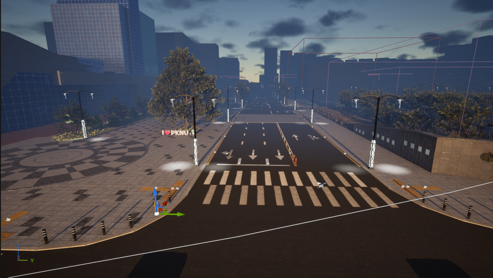
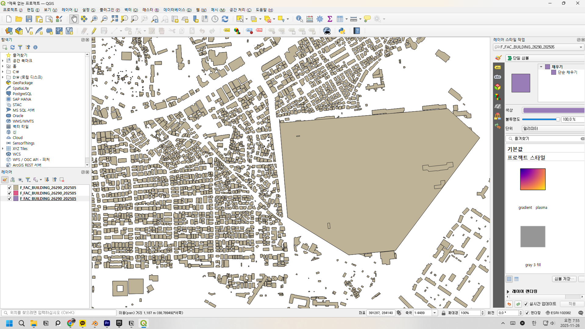
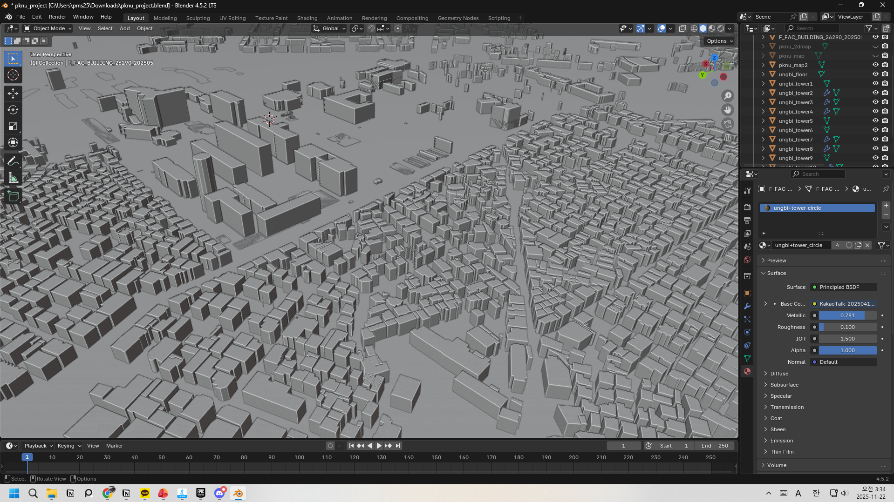
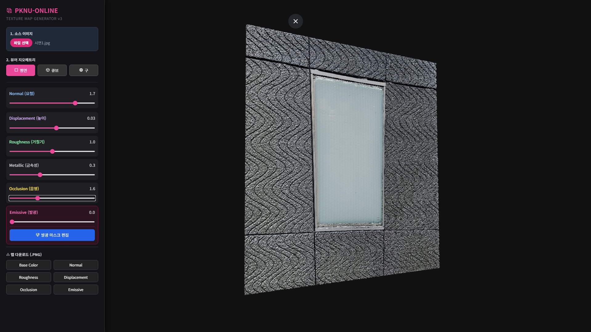
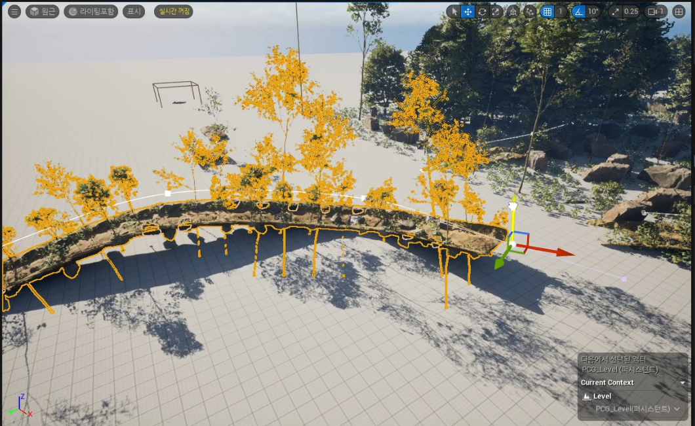
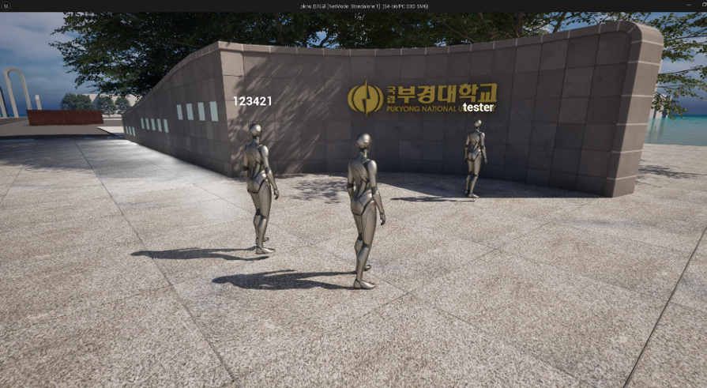

# PKNU-ONLINE

> 생성형 AI와 절차적 생성(PCG)으로 구축한 부경대학교 캠퍼스 디지털 트윈

[](https://youtu.be/jtM6PulHKyw)

> 👆 이미지를 클릭하면 유튜브 소개 영상으로 이동합니다.

| 항목 | 내용 |
| :--- | :--- |
| 기간 | 2025 (캡스톤디자인) |
| 팀 | AVGN (2인)
| 엔진 | Unreal Engine 5 (PCG, Nanite, Lumen) |
| 수상 | 2025 컴퓨터인공지능공학부 캡스톤디자인 경진대회 **장려상** |
| 담당 | Lead Developer — 에셋 파이프라인 설계 및 도구 개발, UE5 환경 구축 |

<br>




<br>

## 🎮 프로젝트 소개

**PKNU-ONLINE** 은 실제 부경대학교 캠퍼스를 1:1 스케일로 재현한 디지털 트윈 콘텐츠입니다.

캠퍼스 규모의 공간을 사람 손으로 모델링하면 일정이 성립하지 않습니다. 그래서 결과물을 직접 만드는 대신, **결과물을 만들어 내는 파이프라인을 먼저 만드는 방향** 으로 접근했습니다. GIS 데이터로 정확한 스케일의 기반 형상을 확보하고, 현장 사진을 입력으로 생성형 AI가 텍스처와 모델을 채우고, 반복 오브젝트는 PCG 알고리즘이 배치하는 구조입니다.

<br>

## 🏆 수상 실적


- **2025 컴퓨터 인공지능 공학부 캡스톤디자인 경진대회 장려상**

<br>

## 🙋 담당 범위

2인 팀 프로젝트이며, 각자의 담당은 다음과 같습니다.

| 영역 | 담당 |
| :--- | :--- |
| GIS 기반 LoD1 매스 모델 구축 | 박민성 |
| 생성형 AI 텍스처 · 3D 모델 에셋 제작 | 박민성 |
| `TaxutreMaker` — 사진 기반 PBR 텍스처 생성 툴 개발 | 박민성 |
| UE5 환경 구축 (PCG · Nanite · Lumen) | 박민성 |
| AI 기반 3D 모델 생성 툴 개발 | 배도영 |
| 멀티플레이 네트워크 환경 구현 | 배도영 |

<br>

## 🛠 Tech Stack

| Category | Technology | Description |
| :--- | :--- | :--- |
| Engine | Unreal Engine 5 | PCG 프레임워크, Nanite, Lumen |
| Language | JavaScript (ES6), HTML5 Canvas | `TaxutreMaker` 텍스처 생성 툴 구현 |
| Web 3D | Three.js (r128) | 실시간 PBR 재질 프리뷰 |
| Data Source | V-World GIS | 건물 도면(LoD0) 및 건물 높이 DB |
| AI Tools | Substance Sampler, Nano Banana | 현장 사진 기반 텍스처 · 3D 모델 생성 |

<br>

## ⚙️ 기술 구현 상세

### 1. GIS 데이터로 스케일 기준을 먼저 확보

생성형 AI의 출력은 그럴듯하지만 치수가 맞지 않습니다. 그래서 **AI를 쓰기 전에 정확한 스케일의 골격을 만드는 순서** 를 택했습니다.

V-World에서 취득한 **건물 도면(LoD0)** 과 **건물 높이 DB** 를 결합해 LoD1 수준의 블록 매스 모델을 생성했습니다. 1:1 스케일 기준이 먼저 서 있으면, 이후 AI가 만드는 텍스처와 디테일은 그 위에 얹히는 문제로 범위가 좁아집니다.




### 2. 생성형 AI 에셋 파이프라인 — 검수 루프를 포함한 설계

현장에서 촬영한 사진을 입력으로 고정해 생성형 AI(Substance Sampler, Nano Banana)의 산출 범위를 좁혔습니다. 프롬프트만으로 결과를 얻는 방식은 캠퍼스 재현이라는 목적과 맞지 않았기 때문입니다.

AI 출력은 편차가 크기 때문에, **품질 검수와 보정 단계를 파이프라인에 명시적으로 포함** 시켰습니다. 생성 → 검수 → 재생성 또는 수동 보정 → 엔진 반영 순서로 돌리고, 검수를 통과하지 못한 출력은 그대로 쓰지 않았습니다.

### 3. TaxutreMaker — 사진 1장에서 PBR 텍스처 5종을 생성하는 웹 툴

파이프라인에서 반복되던 텍스처 맵 변환 작업을 자동화하기 위해 직접 만든 도구입니다. 저장소의 [`TaxutreMaker.html`](TaxutreMaker.html) 파일 하나로 동작하며, 설치 없이 브라우저에서 실행됩니다.



**생성하는 맵**

| 맵 | 생성 방식 |
| :--- | :--- |
| Normal | 픽셀 휘도(ITU-R BT.601 가중치)의 기울기를 구해 기울기 벡터를 탄젠트 공간 노멀 값으로 인코딩 |
| Roughness | 휘도 반전 및 대비 조정 |
| Ambient Occlusion | 휘도 기반 음영 강조 |
| Displacement | 휘도를 높이값으로 매핑 |
| Emissive | 사용자가 브러시로 직접 칠한 마스크에서 생성 |

**구현 포인트**

- **Emissive 마스크 에디터** — 원본과 마스크를 2개 레이어 캔버스로 겹치고, `globalCompositeOperation` 합성 모드로 브러시와 지우개를 구현했습니다. 캔버스의 내부 해상도와 화면 표시 크기가 다르기 때문에, 마우스 좌표를 캔버스 좌표로 변환하는 보정을 넣어 클릭 지점과 실제로 칠해지는 위치를 일치시켰습니다.
- **입력 이미지 리샘플링** — 원본 사진을 그대로 처리하면 픽셀 단위 반복 연산이 감당되지 않아, 입력을 최대 1024px로 리샘플링한 뒤 파이프라인에 넣습니다.
- **WebGL 메모리 관리** — 프리뷰 지오메트리(평면 · 큐브 · 구체)를 교체할 때 이전 지오메트리의 버퍼를 명시적으로 해제해, 반복 전환 시 메모리가 누적되는 문제를 막았습니다.
- **결과 확인과 내보내기** — Three.js `OrbitControls` 로 회전 · 확대하며 재질을 확인하고, 각 맵을 PNG로 내보냅니다.

### 4. PCG 기반 절차적 배치와 Nanite

가로수, 벤치, 구조물처럼 반복되는 오브젝트를 손으로 배치하는 작업은 캠퍼스 규모에서 비효율적입니다. Unreal Engine 5의 **PCG 프레임워크로 규칙을 정의해 자동 배치** 하는 방식으로 전환했습니다.

고해상도 에셋을 프레임 저하 없이 다루기 위해 **Nanite 가상화 지오메트리** 를 적용하고, 조명은 **Lumen** 으로 처리했습니다.



### 5. 멀티플레이어 환경

다수의 유저가 동시에 접속해 상호작용하는 네트워크 환경을 갖추고 있습니다.

> 이 영역은 팀원(배도영)이 구현했습니다.



<br>

## 💡 회고

**결과물보다 파이프라인을 먼저 설계하는 판단을 해 봤습니다.**
캠퍼스 전체를 손으로 만드는 일정은 처음부터 불가능했습니다. 무엇을 자동화하면 남은 작업이 감당 가능한 크기로 줄어드는지 먼저 따져 보고, 그 지점에 도구를 만들었습니다.

**AI 출력을 신뢰하지 않는 구조가 필요했습니다.**
생성형 AI는 결과의 편차가 커서, 파이프라인에 그대로 연결하면 품질이 아니라 운에 의존하게 됩니다. 입력을 현장 사진으로 고정해 산출 범위를 좁히고 검수 단계를 명시적으로 넣은 것은, 도구를 쓰는 일과 도구의 결과를 책임지는 일이 다르다는 것을 겪으며 내린 결정이었습니다.

**필요한 도구를 직접 만드는 편이 빠를 때가 있습니다.**
`TaxutreMaker` 는 기존 툴로 가능한 작업이었지만, 파이프라인에 맞는 형태가 아니었습니다. 픽셀 단위 처리와 WebGL 리소스 관리를 직접 다루면서, 렌더링에 쓰이는 데이터가 어떻게 만들어지는지를 코드 수준에서 이해하게 됐습니다.

**이기종 데이터를 다루는 경험을 했습니다.**
GIS 벡터 데이터, 건물 높이 DB, 현장 사진, AI 생성 텍스처를 하나의 엔진 씬으로 수렴시키는 과정에서 좌표계와 스케일, 대용량 리소스 관리 문제를 처리해야 했습니다.

**한계**
파이프라인의 효과를 수작업 대비 정량적으로 측정하지는 못했습니다. 작업 시간 기록을 남기지 않아 체감상의 개선에 그쳤고, 다음 프로젝트에서는 측정 기준을 먼저 정해 두려고 합니다.

<br>

## 🚀 TaxutreMaker 실행

별도 빌드 과정이 없습니다.

```bash
git clone https://github.com/mns3/PKNU-ONLINE.git
cd PKNU-ONLINE
# TaxutreMaker.html 을 브라우저로 열면 바로 실행됩니다
```

<br>

## 👥 팀 구성

| 이름 | 포지션 | 담당 업무 |
| :---: | :--- | :--- |
| **박민성** | Lead Developer | GIS 기반 LoD1 모델 구축, `TaxutreMaker` 개발, AI 활용 에셋 · 3D 모델 · 텍스처 제작, UE5 환경 구축 |
| **배도영** | Backend Developer | AI 기반 3D 모델 생성 툴 개발, 멀티플레이 환경 구현 |

<br>

## ⚠️ 라이선스 및 저작권

학술 및 포트폴리오 목적의 **비상업적(Non-commercial)** 프로젝트입니다.

- 저장소의 [`LICENSE`](LICENSE)는 이 프로젝트에서 직접 작성한 코드에 적용됩니다.
- 건물 도면 및 높이 데이터의 출처는 **국토교통부 브이월드(V-World)** 이며, 각 데이터의 이용 약관이 적용됩니다.
- `TaxutreMaker` 는 Three.js(MIT), Tailwind CSS(MIT), Phosphor Icons(MIT)를 CDN으로 사용합니다.
- 부경대학교의 명칭 및 시설물 형상을 학술 목적으로 사용했으며, 상업적으로 이용하지 않습니다.
